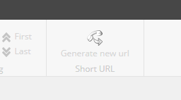

# URL Shortening Service for Sitecore
This repository offers you the source code for the url shortening service made as part of my final exams as programmer. With this service you can generate short url for every site in your sitecore instance. The short url is resolved by this service afterwards which means no external services! All the power is in your hands.
## For administrators
### Compatibility
This module was tested with sitecore 9.1 initial release only. May work with other releases of sitecore 9.1 though.
### How to install?
Installation is fairly easy. 
1. Install the provided SitecoreUrlShorter.zip through the sitecore installation wizard. This has to be done for each content management instance an editor is working on as well as the content delivery instances that should handle the requests to the url shortening service.
2. Open the content editor. The main ribbon has a new strip called "Short URL".

3. Navigate to `/sitecore/system/Modules/URL Shortening Service/URL Shortening Service Settings` inside of your master database and change the settings accordingly. _Note_: You can move this item and its childs to any place within your master database. Just make sure to edit the path in the `App_Config\Include\SitecoreUrlShorter\Feature.Core.config` afterwards.
4. Make sure that each sitecore instance that has the url shortening service installed and is about to handle the requests to the choosen domain has the proper bindings configured in the iis web server.
5. The module is easy to use. Easy as 1-2-3(-4)!

## For editors
### How to use?
Using the module is straight forward.

Just open the sitecore content editor and navigate to the desired item. After you're arrival there we should take a look at the main ribbon. On the right side, you can see a new strip that looks like this:

After you click it, a new random short url is being generated and shown to you afterwards.

With the little icon on the right side you're able to copy the short url directly into your clipboard. You'll see a little message box when everything worked fine.

You can test the proper functionality by opening the short url. It should redirect you right to your desired site.

## FAQ
### I like to generate a new short url, but the button is greyed out. What to do now?
Please check if the selected item has an layout associated to it. As short urls are designed be posted publicly, we have to ensure that a web browser is able to make use of the response created by sitecore. That's only guaranteed if the item contains a layout.

### The item has a layout associated to it but I'm still unable to generate a new short url!
In this case, please contact the maintainer of the module as it looks like something is going wrong internally then.